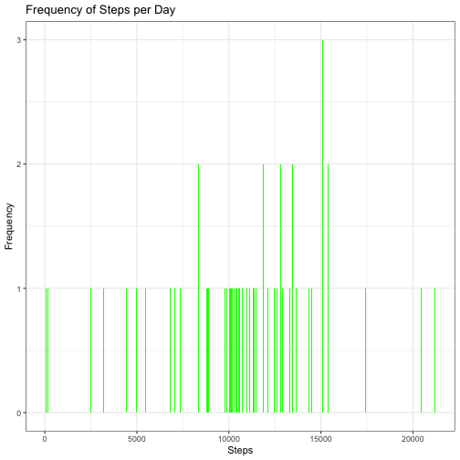
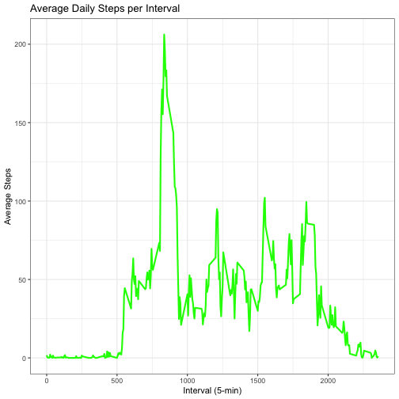
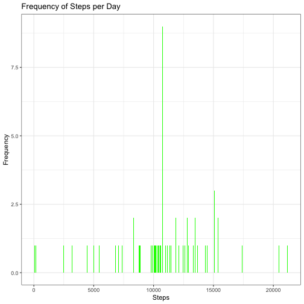
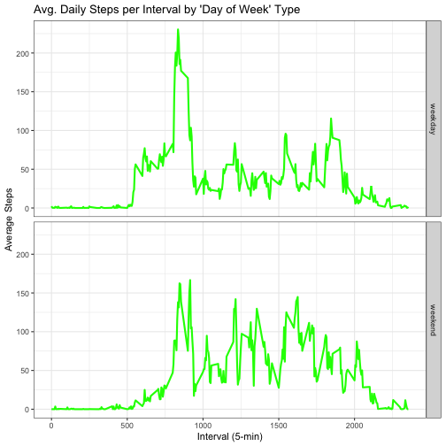

**Loading and preprocessing the data**    
Show any code that is needed to:    
  
1.Load the data (i.e. read.csv())  
2.Process/transform the data (if necessary) into a format suitable for your analysis  
  

``` r
# Load packages
library(ggplot2)
library(dplyr)
```

```
## 
## Attaching package: 'dplyr'
```

```
## The following objects are masked from 'package:stats':
## 
##     filter, lag
```

```
## The following objects are masked from 'package:base':
## 
##     intersect, setdiff, setequal, union
```

``` r
library(data.table)
```

```
## data.table 1.15.4 using 1 threads (see ?getDTthreads).
```

```
## Latest news: r-datatable.com
```

```
## **********
## This installation of data.table has not detected OpenMP support. It should still work but in single-threaded mode.
```

```
## This is a Mac. Please read https://mac.r-project.org/openmp/. Please engage with Apple and ask them for support. Check r-datatable.com for updates, and our Mac instructions here: https://github.com/Rdatatable/data.table/wiki/Installation. After several years of many reports of installation problems on Mac, it's time to gingerly point out that there have been no similar problems on Windows or Linux.
## **********
```

```
## 
## Attaching package: 'data.table'
```

```
## The following objects are masked from 'package:dplyr':
## 
##     between, first, last
```

``` r
# Retrieve data
setwd('~/Documents/Software/R/Data Science Foundations Using R/Reproducible Research/Project1')
path <- getwd()
url <- 'https://d396qusza40orc.cloudfront.net/repdata%2Fdata%2Factivity.zip'
file_path <- file.path(path, 'activity.zip', sep = ',')

# Download and unzip only if necessary
if(!file.exists(file.path(path, 'activity.zip'))) {
  download.file(url, file_path)
  unzip(zipfile = file_path, exdir = path)
}

activity_dt <- data.table::fread(file = 'activity.csv')
str(activity_dt)
```

```
## Classes 'data.table' and 'data.frame':	17568 obs. of  3 variables:
##  $ steps   : int  NA NA NA NA NA NA NA NA NA NA ...
##  $ date    : IDate, format: "2012-10-01" "2012-10-01" "2012-10-01" "2012-10-01" ...
##  $ interval: int  0 5 10 15 20 25 30 35 40 45 ...
##  - attr(*, ".internal.selfref")=<externalptr>
```

``` r
head(activity_dt)
```

```
##    steps       date interval
##    <int>     <IDat>    <int>
## 1:    NA 2012-10-01        0
## 2:    NA 2012-10-01        5
## 3:    NA 2012-10-01       10
## 4:    NA 2012-10-01       15
## 5:    NA 2012-10-01       20
## 6:    NA 2012-10-01       25
```
**What is mean total number of steps taken per day?**  
For this part of the assignment, you can ignore the missing values in the dataset.  
  

``` r
  total_steps = aggregate(steps ~ date, 
                          data = activity_dt, 
                          FUN = sum, 
                          na.rm = FALSE) 
  head(total_steps, 10)
```

```
##          date steps
## 1  2012-10-02   126
## 2  2012-10-03 11352
## 3  2012-10-04 12116
## 4  2012-10-05 13294
## 5  2012-10-06 15420
## 6  2012-10-07 11015
## 7  2012-10-09 12811
## 8  2012-10-10  9900
## 9  2012-10-11 10304
## 10 2012-10-12 17382
```
1.Make a histogram of the total number of steps taken each day 
  

``` r
  ggplot(total_steps, aes(x = steps)) +
  geom_histogram(binwidth = 50, fill='green') +
  labs(title = 'Frequency of Steps per Day', x = 'Steps', y = 'Frequency') + 
  theme_bw()
```


  
2.Calculate and report the mean and median total number of steps taken per day  

``` r
  # mean_steps <- mean(total_steps$steps, na.rm = TRUE)
  # median_steps <- median(total_steps$steps, na.rm = TRUE)
  
  summary_stats <- total_steps %>%
    summarise(
      mean_steps = mean(steps, na.rm = TRUE),
      median_steps = median(steps, na.rm = TRUE)
    )

  summary_stats$mean_steps
```

```
## [1] 10766.19
```

``` r
  summary_stats$median_steps
```

```
## [1] 10765
```
**What is the average daily activity pattern?**  
1.Make a time series plot (i.e. type = "l") of the 5-minute interval (x-axis)  and the average number of steps taken, averaged across all days (y-axis)  
  

``` r
  interval_dt <- activity_dt[, lapply(.SD, mean, na.rm=TRUE), 
                             .SDcols = c('steps'), 
                             by = interval]
  setnames(interval_dt, "steps", "avg_steps")
  
  head(interval_dt)
```

```
##    interval avg_steps
##       <int>     <num>
## 1:        0 1.7169811
## 2:        5 0.3396226
## 3:       10 0.1320755
## 4:       15 0.1509434
## 5:       20 0.0754717
## 6:       25 2.0943396
```

``` r
  ggplot(interval_dt, aes(x = interval , y = avg_steps)) + 
  geom_line(color="green", linewidth=1) + 
  labs(title = "Average Daily Steps per Interval", 
       x = "Interval (5-min)", 
       y = "Average Steps") +
  theme_bw()
```




2.Which 5-minute interval, on average across all the days in the dataset, contains the maximum number of steps?  
  

``` r
  interval_dt[avg_steps == max(avg_steps), interval]
```

```
## [1] 835
```
  
**Imputing missing values**  
Note that there are a number of days/intervals where there are missing values (coded as NA). The presence of missing days may introduce bias into some calculations or summaries of the data.  
  
1.Calculate and report the total number of missing values in the dataset (i.e. the total number of rows with NAs)  


``` r
  # is.na(activity_dt): logical matrix where each element is TRUE if 
  # it's NA and FALSE otherwise.
  
  # rowSums(is.na(activity_dt)): calculates the sum of TRUE values 
  # (i.e., NAs) for each row. If any column in a row contains NA, 
  # the sum will be greater than zero.

  activity_dt[rowSums(is.na(activity_dt)) > 0, .N]
```

```
## [1] 2304
```
  
2.Devise a strategy for filling in all of the missing values in the dataset. The strategy does not need to be sophisticated. For example, you could use the mean/median for that day, or the mean for that 5-minute interval, etc.  
  
3.Create a new dataset that is equal to the original dataset but with the missing data filled in.  
  

``` r
  # Imputing NAs with the mean for the 5-minute interval
  # Convert [steps] from int to double
  activity_imputed_dt <- activity_dt[, steps := as.numeric(steps)]

  # Merge activity_dt with interval_dt on interval
  activity_imputed_dt <- merge(activity_imputed_dt, 
                               interval_dt, 
                               by = c('interval'), 
                               all.x = TRUE)
  # Replace NA values in [steps] with [avg_steps]
  activity_imputed_dt[is.na(steps), steps := avg_steps]
  
  # remove [avg_steps] column
  activity_imputed_dt[, avg_steps := NULL]

  head(activity_imputed_dt)
```

```
## Key: <interval>
##    interval     steps       date
##       <int>     <num>     <IDat>
## 1:        0  1.716981 2012-10-01
## 2:        0  0.000000 2012-10-02
## 3:        0  0.000000 2012-10-03
## 4:        0 47.000000 2012-10-04
## 5:        0  0.000000 2012-10-05
## 6:        0  0.000000 2012-10-06
```
  
4.Make a histogram of the total number of steps taken each day and Calculate and report the mean and median total number of steps taken per day.
  

``` r
  total_steps_imputed = aggregate(steps ~ date, 
                                  data = activity_imputed_dt, 
                                  FUN = sum, 
                                  na.rm = FALSE) 
  head(total_steps_imputed, 10)
```

```
##          date    steps
## 1  2012-10-01 10766.19
## 2  2012-10-02   126.00
## 3  2012-10-03 11352.00
## 4  2012-10-04 12116.00
## 5  2012-10-05 13294.00
## 6  2012-10-06 15420.00
## 7  2012-10-07 11015.00
## 8  2012-10-08 10766.19
## 9  2012-10-09 12811.00
## 10 2012-10-10  9900.00
```

``` r
  ggplot(total_steps_imputed, aes(x = steps)) +
  geom_histogram(binwidth = 50, fill='green') +
  labs(title = 'Frequency of Steps per Day', x = 'Steps', y = 'Frequency') + 
  theme_bw()
```



``` r
  summary_stats <- total_steps_imputed %>%
    summarise(
      mean_steps = mean(steps, na.rm = TRUE),
      median_steps = median(steps, na.rm = TRUE)
    )

  summary_stats$mean_steps
```

```
## [1] 10766.19
```

``` r
  summary_stats$median_steps
```

```
## [1] 10766.19
```
  
4.1.Do these values differ from the estimates from the first part of the assignment?  
No, the mean and median steps per day are identical to the results in the first part of the assignment.  

<table border="1" cellpadding="10" cellspacing="0">
  <tr>
    <th>Type of Estimate</th>
    <th>Mean</th>
    <th>Median</th>
  </tr>
  <tr>
    <td>First part (with NA)</td>
    <td>10766.19</td>
    <td>10765</td>
  </tr>
  <tr>
    <td>Second part (Impute NA with Avg per Interval)</td>
    <td>10766.19</td>
    <td>10765</td>
  </tr>
</table>  
  
    
4.2.What is the impact of imputing missing data on the estimates of the total daily number of steps?  
The total daily number of steps increases on days where steps were NA.
  
**Are there differences in activity patterns between weekdays and weekends?**  
For this part the weekdays() function may be of some help here. Use the dataset with the filled-in missing values for this part.  
  
1.Create a new factor variable in the dataset with two levels -- "weekday" and "weekend" indicating whether a given date is a weekday or weekend day.  


``` r
  # activity_imputed_dt
  # total_steps_imputed


  activity_imputed_dt <- activity_imputed_dt[, date := as.POSIXct(date, format = '%Y-%m-%d')]

	# Add a new column
  activity_imputed_dt <- activity_imputed_dt[, day_of_week := weekdays(as.Date(c(date)))]
  
  # convert to weekday / weekend
  activity_imputed_dt <- activity_imputed_dt[, day_of_week := ifelse(day_of_week %in% c("Saturday", "Sunday"), "weekend", "weekday")]
  
  activity_imputed_dt[, day_of_week := as.factor(day_of_week)]
  
  head(activity_imputed_dt)
```

```
## Key: <interval>
##    interval     steps       date day_of_week
##       <int>     <num>     <POSc>      <fctr>
## 1:        0  1.716981 2012-10-01     weekday
## 2:        0  0.000000 2012-10-02     weekday
## 3:        0  0.000000 2012-10-03     weekday
## 4:        0 47.000000 2012-10-04     weekday
## 5:        0  0.000000 2012-10-05     weekday
## 6:        0  0.000000 2012-10-06     weekend
```
  
2.Make a panel plot containing a time series plot (i.e. type = "l") of the 5-minute interval (x-axis) and the average number of steps taken, averaged across all weekday days or weekend days (y-axis). The plot should look something like the following, which was created using simulated data:  


``` r
  interval_imputed_dt <- activity_imputed_dt[, lapply(.SD, mean, na.rm=TRUE), 
                                            .SDcols = c('steps'), 
                                            by = .(interval, day_of_week)]
  setnames(interval_imputed_dt, "steps", "avg_steps")
  
  head(interval_imputed_dt)
```

```
##    interval day_of_week  avg_steps
##       <int>      <fctr>      <num>
## 1:        0     weekday 2.25115304
## 2:        0     weekend 0.21462264
## 3:        5     weekday 0.44528302
## 4:        5     weekend 0.04245283
## 5:       10     weekday 0.17316562
## 6:       10     weekend 0.01650943
```

``` r
  ggplot(interval_imputed_dt, aes(x = interval, y = avg_steps, color = day_of_week)) +
  geom_line(color="green", linewidth=1) + 
  labs(title = "Avg. Daily Steps per Interval by 'Day of Week' Type", 
       x = "Interval (5-min)", 
       y = "Average Steps") +
  facet_grid(day_of_week ~.) +
  theme_bw()
```


  
